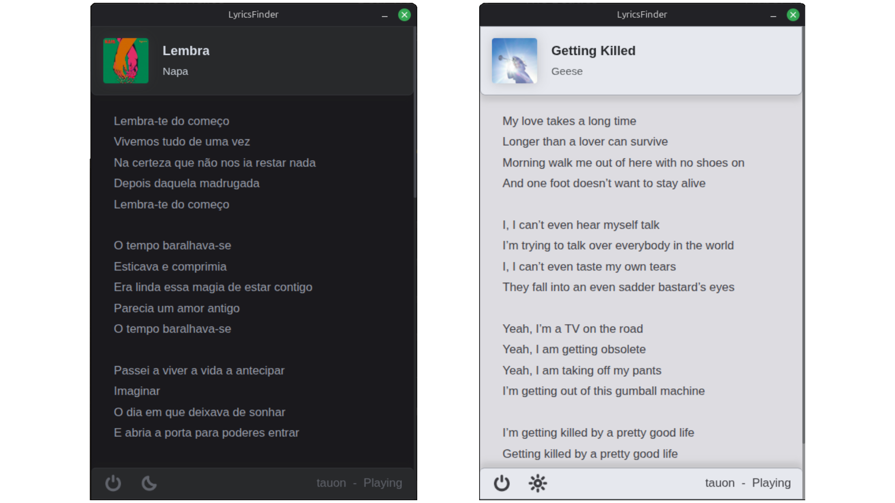

# LyricsFinder

> [!WARNING]
> This app is **NOT** code signed.\
> Antivirus pop-ups may appear when running it. That does not mean it is unsafe. If unconvinced [build it yourself](BUILD.md).

## About this project

**LyricsFinder** checks for currently playing media on your device and displays lyrics from [*lyrics.ovh*](https://lyrics.ovh/), if found. Works on **Windows** and **Linux** (requires playerctl). It also has switchable light mode/dark mode. That's all :)

> [!NOTE]
> Lyrics.ovh can be subject to server outages, which would prevent LyricsFinder from working. As of today, there is no fallback API.

## How it works

This project is made with Electron. The [main Electron NodeJS process](main.js) spawns a [PyInstaller executable](pyInstaller) built from the included [main.py](main.py) file, so that the end user doesn't have to install Python or any packages used by the program. Depending on the platform, the Python process gathers currently playing media metadata using Windows Runtime GlobalSystemMediaTransportControlsSessionManager or Linux playerctl (title, artist, cover, player, status). It then performs a HTTP GET request to *api.lyrics.ovh* and retrieves the media lyrics, if the request returns any. It formats and sends the info back to the main NodeJS process and then NodeJS sends the info to the [renderer process](renderer.js), so that it's passed to the HTML document (the UI). 

I used the NodeJS/Python inter-process communication method highlighted in [this post](https://dev.to/besworks/inter-process-communication-between-nodejs-and-python-djf).

## Development

This my first "bigger" coding project. I created it mainly for my personal use.

Some development decisions may seem quite odd. Like having a Python back-end while using Electron, despite the fact that my code would work flawlessly in NodeJS. Or (vise-versa) using Electron for a Python app that would do fine with a Python UI framework like PyQt.

It all boils down to me wanting to hone my skills in Electron, it's inter-process communication, HTML, CSS, etc. and I wanted to try achieving all that in one project.

Learning coding in the AI era is a bit scary. It's difficult to differentiate between the fearmongering of AI company CEOs and the actual unbiased information. I have hope, however, that the situation can get better. It only takes a few people to make a big difference.

I admit that the code may be a bit wonky, feel free to share any tips/issues that you may have.

## .

2026 - Made with ❤️ in 🇸🇰
